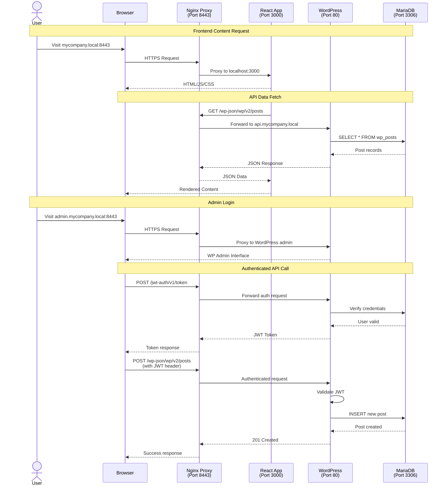
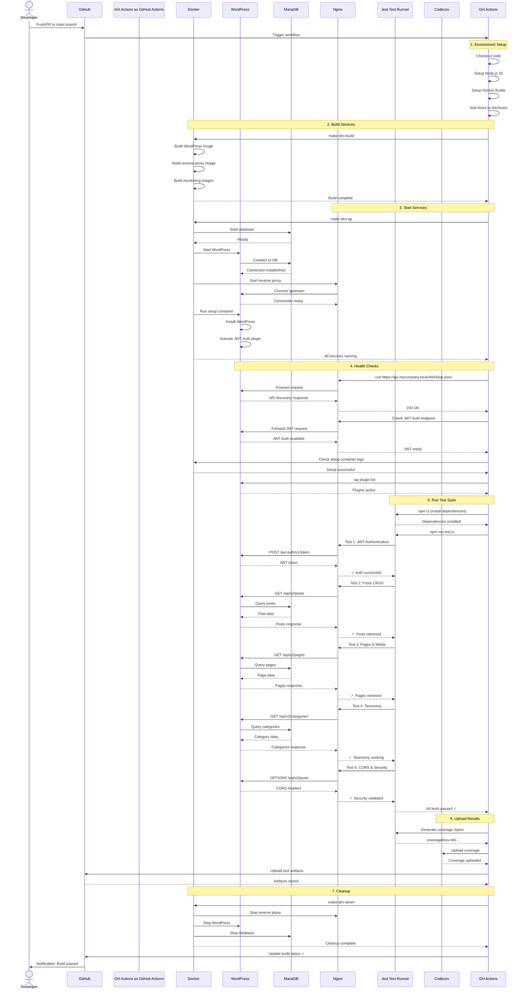

<div align="center">

# 🚀 Headless WordPress

**A modern headless CMS setup using WordPress as a backend with a custom React frontend**

<br/>

[](https://opensource.org/licenses/MIT)
[](https://github.com/jadecubes/Headless-Wordpress/actions/workflows/api-tests.yml)
[](https://github.com/jadecubes/Headless-Wordpress/actions/workflows/api-tests.yml)
[](https://www.docker.com/)
[](https://wordpress.org/)
[](https://reactjs.org/)
[](https://nginx.org/)

[](https://mariadb.org/)
[](https://grafana.com/)
[](https://grafana.com/loki)
[](http://makeapullrequest.com)
[](https://github.com/yourusername/Headless-Wordpress/graphs/commit-activity)

</div>

---

## Why Headless WordPress?

- **Decoupled Architecture** - Use WordPress solely as a content management backend via REST API
- **Modern Frontend** - Build with React and modern JavaScript frameworks for optimal performance
- **Scalability** - Scale frontend and backend independently based on your needs
- **Developer Experience** - Local development environment with Docker, HTTPS, and observability tools included
- **Flexibility** - Complete control over your frontend while leveraging WordPress's powerful content management

---

## Features

✨ **Complete Docker Setup** - Pre-configured Docker Compose with all services
🔒 **HTTPS in Development** - Local SSL certificates using mkcert
📊 **Observability Stack** - Integrated Grafana, Loki, and Promtail for monitoring
🔄 **Reverse Proxy** - Nginx reverse proxy with separate admin and API endpoints
🗄️ **Database Management** - Adminer included for easy database access
🚀 **Production-Ready** - Architecture designed for easy deployment to production

---

## Prerequisites

- [Docker Desktop](https://www.docker.com/products/docker-desktop) installed
- [mkcert](https://github.com/FiloSottile/mkcert) for local SSL certificates (optional, certs included)
- Make utility (usually pre-installed on Mac/Linux)

---

## Getting Started

### Quick Start

```bash
# Build the Docker images
make dev-build

# Start all services
make dev-up

# Stop all services
make dev-down
```

### Access Points

Once started, you can access:

- **Admin Portal**: https://admin.mycompany.local:8443
- **REST API**: https://api.mycompany.local:8443/wp-json
- **Frontend**: https://mycompany.local:8443 (proxied to localhost:3000 in dev)
- **Direct WordPress**: http://localhost:8080
- **Adminer (DB GUI)**: http://localhost:9091
- **Grafana**: http://localhost:3001


## Who is Which
- https://admin.mycompany.local:8443 → always show the WP login/admin (no public site)
- https://api.mycompany.local:8443 → WP REST API only
- https://mycompany.local:8443 → React front-end (proxied to localhost:3000 in dev)


## Notes
- Certificate and key are generated by mkcert
  ```bash
  mkcert \
  -cert-file reverse-proxy/certs/certs/api.crt \
  -key-file  reverse-proxy/certs/private/api.key \
  "api.mycompany.local" "admin.mycompany.local" "localhost" "127.0.0.1" "::1"
  ```
- It's the development environment included in the repository.

---

## Architecture Overview

This project uses a decoupled headless CMS architecture where WordPress serves as the content management backend through its REST API, while a separate React frontend handles the user interface.

#### UML Component Diagram: System Architecture

```mermaid
graph TB
    subgraph "Client Layer"
        Browser[Web Browser]
    end

    subgraph "Reverse Proxy Layer - Port 8443"
        Nginx[Nginx Reverse Proxy<br/>SSL Termination]
    end

    subgraph "Application Layer"
        Frontend[React Frontend<br/>Port 3000<br/>Modern UI]
        WordPress[WordPress Core<br/>Port 80<br/>Headless CMS]
        Setup[Setup Container<br/>WP Install & Config]
        WPCli[WP-CLI<br/>Management Tools]
    end

    subgraph "Data Layer"
        MariaDB[(MariaDB<br/>Port 3306<br/>Content DB)]
    end

    subgraph "Observability Stack"
        Promtail[Promtail<br/>Log Collector]
        Loki[Loki<br/>Log Storage]
        Grafana[Grafana<br/>Port 3001<br/>Dashboards]
    end

    subgraph "Management Tools"
        Adminer[Adminer<br/>Port 9091<br/>DB Admin]
    end

    Browser -->|HTTPS:8443<br/>mycompany.local| Nginx
    Browser -->|HTTPS:8443<br/>admin.mycompany.local| Nginx
    Browser -->|HTTPS:8443<br/>api.mycompany.local| Nginx
    Browser -->|HTTP:3001| Grafana
    Browser -->|HTTP:9091| Adminer

    Nginx -->|Proxy Pass<br/>mycompany.local| Frontend
    Nginx -->|Proxy Pass<br/>admin.mycompany.local| WordPress
    Nginx -->|Proxy Pass<br/>api.mycompany.local/wp-json| WordPress

    Frontend -.->|REST API Calls| Nginx
    WordPress -->|SQL Queries| MariaDB
    Setup -->|Configure & Install| WordPress
    WPCli -->|CLI Commands| WordPress

    WordPress -->|Write Logs| Promtail
    Nginx -->|Write Logs| Promtail
    MariaDB -->|Write Logs| Promtail
    Promtail -->|Stream Logs| Loki
    Loki -->|Query Logs| Grafana

    Adminer -->|SQL Connection| MariaDB

    style Browser fill:#e1f5ff
    style Nginx fill:#90EE90
    style Frontend fill:#FFD700
    style WordPress fill:#0073aa
    style MariaDB fill:#003545
    style Grafana fill:#F46800
    style Loki fill:#F46800
    style Promtail fill:#F46800
```



#### Request Flow Sequence



### Key Components

- **Nginx Reverse Proxy**: Routes traffic to appropriate backends with SSL termination
  - `mycompany.local` → React Frontend
  - `admin.mycompany.local` → WordPress Admin
  - `api.mycompany.local` → WordPress REST API

- **WordPress**: Headless CMS providing REST API and admin interface
  - JWT Authentication for secure API access
  - REST API endpoints for content
  - Media management and uploads

- **MariaDB**: Relational database for WordPress data
  - Content storage (posts, pages, media)
  - User authentication data
  - WordPress configuration and metadata

- **React Frontend**: Custom UI consuming WordPress REST API
  - Modern, fast user experience
  - Decoupled from WordPress presentation layer

- **Grafana Stack**: Log aggregation and monitoring
  - **Promtail**: Collects logs from all Docker containers
  - **Loki**: Aggregates and indexes logs
  - **Grafana**: Visualizes logs and creates dashboards

- **Adminer**: Web-based database management tool
  - Direct database access for development
  - SQL query interface

---

## CI/CD Pipeline & Testing

### Automated Testing Flow

Our CI/CD pipeline ensures code quality through automated testing on every push and pull request.

#### UML Sequence Diagram: CI/CD Testing Process



**Workflow File**: `.github/workflows/api-tests.yml`

### Test Coverage

The automated test suite covers:

1. **JWT Authentication** (`01-jwt-auth.test.ts`)
   - Login flows, token validation, security checks

2. **Posts API** (`02-posts.test.ts`)
   - CRUD operations, pagination, search, filtering

3. **Pages & Media** (`03-pages-media.test.ts`)
   - Page management, media uploads, metadata

4. **Taxonomy** (`04-taxonomy.test.ts`)
   - Categories, tags, users, custom taxonomies

5. **CORS & Security** (`05-cors-security.test.ts`)
   - CORS headers, authentication, authorization, error handling

For detailed test documentation, see [tests/README.md](tests/README.md)

---

## Development Workflow

### Local Development

```bash
# 1. Start development environment
make dev-up

# 2. Access the services
# - WordPress Admin: https://admin.mycompany.local:8443
# - REST API: https://api.mycompany.local:8443/wp-json
# - Frontend: https://mycompany.local:8443

# 3. Make your changes to WordPress or frontend code

# 4. Run tests locally
cd tests
npm install
npm test

# 5. Stop services when done
make dev-down
```

### Making Changes

#### Backend (WordPress) Changes

1. Modify WordPress configuration in `compose.core.yaml`
2. Add plugins/themes to the WordPress container
3. Update environment variables as needed
4. Rebuild: `make dev-build`

#### Frontend Changes

1. Edit React components (not included in this repo)
2. Frontend runs on `localhost:3000`
3. Nginx proxies to React dev server

#### Infrastructure Changes

1. Modify Docker Compose files:
   - `compose.core.yaml` - Core services
   - `compose.reverse-proxy.yaml` - Nginx configuration
   - `compose.monitoring.yaml` - Observability stack
2. Update Nginx configuration in `reverse-proxy/`
3. Rebuild and restart: `make dev-build && make dev-up`

### Available Make Commands

```bash
make dev-build    # Build Docker images
make dev-up       # Start all services
make dev-down     # Stop all services
make dev-logs     # View service logs
make dev-restart  # Restart services
```

---

## Monitoring & Observability

### Grafana Dashboard

Access Grafana at `http://localhost:3001` to view:
- Application logs from all services
- WordPress access and error logs
- Nginx proxy logs
- Database query logs

**Default credentials**: admin/admin (change on first login)

### Log Aggregation

The stack uses:
- **Promtail**: Collects logs from Docker containers
- **Loki**: Stores and indexes logs
- **Grafana**: Visualizes logs and creates dashboards

### Monitoring WordPress

```bash
# View WordPress logs
docker compose logs -f wordpress

# View database logs
docker compose logs -f db

# View all logs
make dev-logs

# Check container health
docker compose ps
```

---

## Deployment

### Production Considerations

Before deploying to production:

1. **Security**
   - Change all default passwords
   - Generate new JWT secret keys
   - Use proper SSL certificates (not self-signed)
   - Enable WordPress security plugins
   - Configure proper CORS origins

2. **Database**
   - Use managed database service (RDS, Cloud SQL)
   - Set up regular backups
   - Enable SSL connections
   - Tune performance parameters

3. **WordPress**
   - Enable caching (Redis, Memcached)
   - Configure CDN for media files
   - Set up automated backups
   - Enable security headers

4. **Nginx**
   - Configure rate limiting
   - Enable HTTP/2
   - Set up proper caching headers
   - Add DDoS protection

5. **Monitoring**
   - Set up alerts for errors
   - Monitor API response times
   - Track database performance
   - Configure log retention policies

### Environment Variables

Key environment variables to configure:

```bash
# Database
DB_NAME=wordpress
DB_USER=wp_user
DB_PASSWORD=secure_password

# WordPress
WP_ADMIN_USER=admin
WP_ADMIN_PASS=secure_password
WP_ADMIN_EMAIL=admin@example.com

# JWT
JWT_SECRET_KEY=generate_secure_key_here

# Domains
ADMIN_HOST=admin.yoursite.com
API_HOST=api.yoursite.com
```

---

## Troubleshooting

### Common Issues

#### SSL Certificate Errors

**Problem**: Browser shows SSL warnings or certificate errors

**Solution**:
```bash
# Ensure certificates are valid
ls -la reverse-proxy/certs/certs/
ls -la reverse-proxy/certs/private/

# Regenerate certificates if needed
mkcert -cert-file reverse-proxy/certs/certs/api.crt \
       -key-file reverse-proxy/certs/private/api.key \
       "api.mycompany.local" "admin.mycompany.local" "localhost"
```

#### Services Not Starting

**Problem**: Docker services fail to start

**Solution**:
```bash
# Check for port conflicts
lsof -i :8080  # WordPress
lsof -i :8443  # Nginx
lsof -i :3306  # MariaDB

# Stop all services and restart
make dev-down
docker system prune -f
make dev-build
make dev-up
```

#### Database Connection Errors

**Problem**: WordPress can't connect to database

**Solution**:
```bash
# Check database is running
docker compose ps db

# View database logs
docker compose logs db

# Verify credentials match in compose.core.yaml
# Check DB_HOST, DB_NAME, DB_USER, DB_PASSWORD
```

#### WordPress Setup Not Completing

**Problem**: WordPress installation hangs or fails

**Solution**:
```bash
# Check setup container logs
docker compose logs setup

# Restart setup container
docker compose up setup --force-recreate

# Verify plugins installed
docker compose run --rm wpcli wp plugin list --allow-root
```

#### Test Failures

**Problem**: Tests fail locally or in CI

**Solution**:
```bash
# Ensure all services are healthy
curl -k https://api.mycompany.local:8443/wp-json/

# Check test environment variables
cat tests/.env.test

# Run tests with verbose output
cd tests
npm test -- --verbose

# Check WordPress logs during test run
docker compose logs -f wordpress
```

#### Port Already in Use

**Problem**: Cannot start services due to port conflicts

**Solution**:
```bash
# Find process using port
lsof -i :8080

# Kill the process or change port in compose files
# Edit compose.core.yaml or compose.reverse-proxy.yaml
```

### Getting Help

- Check [GitHub Issues](https://github.com/jadecubes/Headless-Wordpress/issues)
- Review [tests/README.md](tests/README.md) for test-specific issues
- Check Docker logs: `make dev-logs`
- Verify `/etc/hosts` configuration

---

## Contributing

We welcome contributions! Here's how to get started:

### Setting Up for Development

1. Fork the repository
2. Clone your fork: `git clone https://github.com/yourusername/Headless-Wordpress.git`
3. Create a branch: `git checkout -b feature/your-feature-name`
4. Set up the environment: `make dev-build && make dev-up`

### Making Changes

1. Make your changes to the codebase
2. Add tests for new features (see `tests/README.md`)
3. Run tests locally: `cd tests && npm test`
4. Ensure all tests pass before submitting

### Code Style

- Use clear, descriptive commit messages
- Follow existing code structure and patterns
- Add comments for complex logic
- Update documentation for new features

### Submitting Pull Requests

1. Ensure all tests pass locally
2. Update README.md if adding features
3. Add test coverage for new functionality
4. Push to your fork: `git push origin feature/your-feature-name`
5. Open a Pull Request with:
   - Clear description of changes
   - Link to related issues
   - Screenshots (if UI changes)
   - Test results

### Running Tests

Before submitting:

```bash
# Run full test suite
cd tests
npm test

# Run with coverage
npm run test:coverage

# Ensure coverage meets requirements
```

### Reporting Bugs

When reporting bugs, include:
- Steps to reproduce
- Expected behavior
- Actual behavior
- Environment details (OS, Docker version)
- Relevant logs (`make dev-logs`)

### Feature Requests

For feature requests:
- Describe the use case
- Explain the expected benefit
- Provide examples if possible

---

## Acknowledgments

- WordPress Core Team
- React Community
- Docker & Docker Compose
- Grafana Labs (Loki & Grafana)
- All contributors


