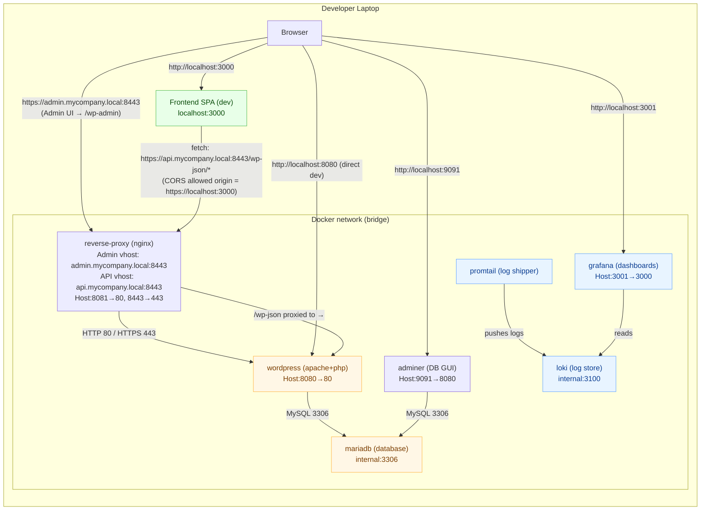

# Headless-Wordpress


## How to Run Headless Wordpress?
In the environment where Docker Desktop is installed, execute commands below to launch. Commands work correctly on Mac Silicon.

```
# Commands to launch
make dev-build
make dev-up

# Commands to terminate
make dev-down
```
You can get the portal in ```https://admin.mycompany.local:8443``` after you launch the website.


## Who is Which
- https://admin.mycompany.local:8443 → always show the WP login/admin (no public site)
- https://api.mycompany.local:8443 → WP REST API only
- https://mycompany.local:8443 → React front-end (proxied to localhost:3000 in dev)


## Notes
- Certificate and key in the repository are self-signed.
- It's the development environment included in the repository.


