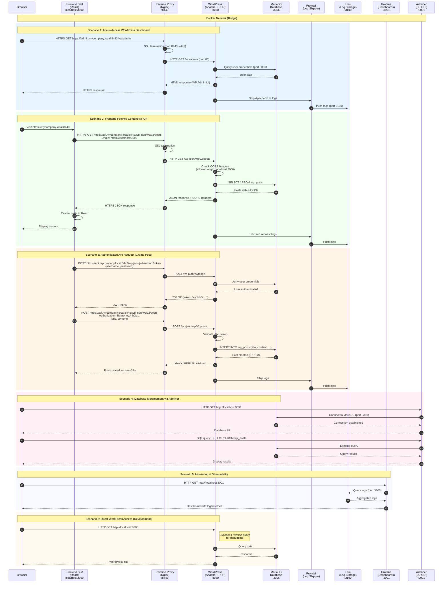
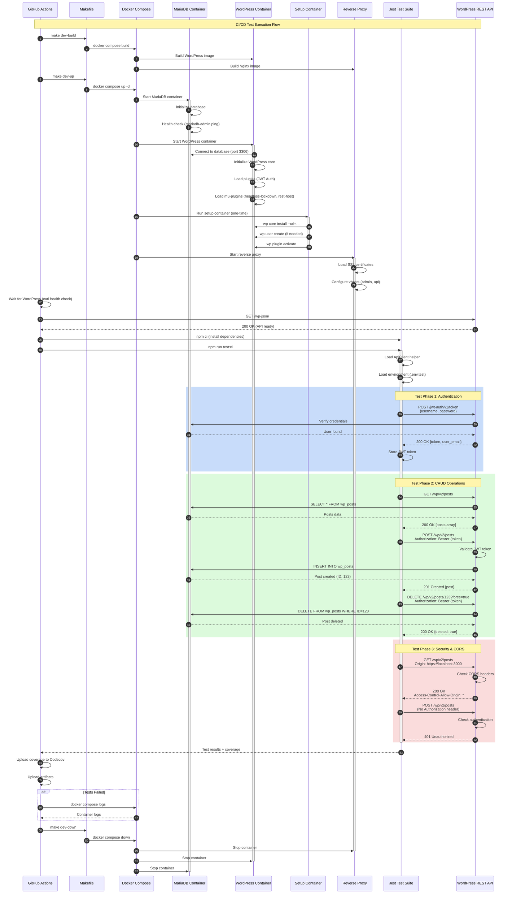

<div align="center">

# 🚀 Headless WordPress

**A modern headless CMS setup using WordPress as a backend with a custom React frontend**

<br/>

[](https://opensource.org/licenses/MIT)
[](https://www.docker.com/)
[](https://wordpress.org/)
[](https://reactjs.org/)
[](https://nginx.org/)

[](https://mariadb.org/)
[](https://grafana.com/)
[](https://grafana.com/loki)
[](http://makeapullrequest.com)
[](https://github.com/yourusername/Headless-Wordpress/graphs/commit-activity)

</div>

---

## Why Headless WordPress?

- **Decoupled Architecture** - Use WordPress solely as a content management backend via REST API
- **Modern Frontend** - Build with React and modern JavaScript frameworks for optimal performance
- **Scalability** - Scale frontend and backend independently based on your needs
- **Developer Experience** - Local development environment with Docker, HTTPS, and observability tools included
- **Flexibility** - Complete control over your frontend while leveraging WordPress's powerful content management

---

## Features

✨ **Complete Docker Setup** - Pre-configured Docker Compose with all services
🔒 **HTTPS in Development** - Local SSL certificates using mkcert
📊 **Observability Stack** - Integrated Grafana, Loki, and Promtail for monitoring
🔄 **Reverse Proxy** - Nginx reverse proxy with separate admin and API endpoints
🗄️ **Database Management** - Adminer included for easy database access
🚀 **Production-Ready** - Architecture designed for easy deployment to production

---

## Prerequisites

- [Docker Desktop](https://www.docker.com/products/docker-desktop) installed
- [mkcert](https://github.com/FiloSottile/mkcert) for local SSL certificates (optional, certs included)
- Make utility (usually pre-installed on Mac/Linux)

---

## Getting Started

### Quick Start

```bash
# Build the Docker images
make dev-build

# Start all services
make dev-up

# Stop all services
make dev-down
```

### Access Points

Once started, you can access:

- **Admin Portal**: https://admin.mycompany.local:8443
- **REST API**: https://api.mycompany.local:8443/wp-json
- **Frontend**: https://mycompany.local:8443 (proxied to localhost:3000 in dev)
- **Direct WordPress**: http://localhost:8080
- **Adminer (DB GUI)**: http://localhost:9091
- **Grafana**: http://localhost:3001


---

## Architecture

The project uses a containerized microservices architecture. The following sequence diagram illustrates how different components interact in typical user scenarios:



---

### Service Breakdown

| Service | Purpose | Port Mapping |
|---------|---------|-------------|
| **reverse-proxy** | Nginx reverse proxy with SSL termination | 8081→80, 8443→443 |
| **wordpress** | WordPress backend (Apache + PHP) | 8080→80 |
| **mariadb** | MySQL database | Internal 3306 |
| **adminer** | Database management UI | 9091→8080 |
| **promtail** | Log shipping agent | - |
| **loki** | Log aggregation and storage | Internal 3100 |
| **grafana** | Monitoring dashboards | 3001→3000 |
| **Frontend** | React SPA (development) | 3000 |

---

## Endpoint Reference

### WordPress Admin
- **URL**: https://admin.mycompany.local:8443
- **Purpose**: WordPress login and admin dashboard (no public site)
- **Direct Access**: http://localhost:8080 (bypasses reverse proxy)

### REST API
- **URL**: https://api.mycompany.local:8443/wp-json
- **Purpose**: WordPress REST API for headless CMS
- **CORS**: Configured to allow https://localhost:3000

### Frontend
- **URL**: https://mycompany.local:8443
- **Purpose**: React frontend application
- **Development**: Proxied to localhost:3000

---

## Development

### SSL Certificates

The project includes SSL certificates generated using [mkcert](https://github.com/FiloSottile/mkcert) for local development with HTTPS.

To regenerate certificates:

```bash
mkcert \
  -cert-file reverse-proxy/certs/certs/api.crt \
  -key-file  reverse-proxy/certs/private/api.key \
  "api.mycompany.local" "admin.mycompany.local" "localhost" "127.0.0.1" "::1"
```

### Environment Configuration

This is a complete development environment included in the repository. All configuration files are pre-configured for local development on Mac Silicon (also works on other platforms with Docker support).

### Monitoring & Logs

Access Grafana at http://localhost:3001 to view:
- Application logs (aggregated by Loki)
- Container metrics
- Custom dashboards

---

## Testing

The project includes a comprehensive API test suite covering all WordPress REST API endpoints.

### Test Flow Architecture

The following sequence diagram illustrates how the test infrastructure works:



### Quick Test

```bash
# Run full test suite (builds, starts services, runs tests)
make test-full

# Or run tests against already running services
make test-install  # Install dependencies (first time only)
make test          # Run all tests
```

### Available Test Commands

| Command | Description |
|---------|-------------|
| `make test-full` | Complete test cycle: build → start → install → test |
| `make test-setup` | Build and start Docker services for testing |
| `make test-install` | Install test dependencies |
| `make test` | Run all API tests |
| `make test-watch` | Run tests in watch mode (auto-rerun on changes) |
| `make test-coverage` | Run tests with coverage report |
| `make test-ci` | Run tests in CI mode (for GitHub Actions) |
| `make test-clean` | Clean test artifacts and dependencies |

### Test Coverage

The test suite covers:

- ✅ **JWT Authentication** - Login, token validation, refresh
- ✅ **Posts API** - CRUD operations, pagination, search, filtering
- ✅ **Pages API** - CRUD operations, hierarchical pages
- ✅ **Media API** - List, get, filter by type
- ✅ **Taxonomy API** - Categories, tags, custom taxonomies
- ✅ **Users API** - List users, current user profile
- ✅ **CORS & Security** - Headers, authentication, error handling
- ✅ **API Discovery** - Root endpoint, namespaces, routes

For detailed testing documentation, see [`tests/README.md`](tests/README.md).

### CI/CD Integration

Tests run automatically on:
- ✓ Pull requests
- ✓ Pushes to main branch
- ✓ Manual workflow dispatch

View the workflow: [`.github/workflows/api-tests.yml`](.github/workflows/api-tests.yml)

---

## Contributing

Contributions are welcome! Please feel free to submit a Pull Request.

When contributing:
1. Write tests for new features
2. Ensure all tests pass: `make test-full`
3. Update documentation as needed

---

## License

This project is licensed under the MIT License.

---

<div align="center">

**Built with ❤️ using WordPress, React, and Docker**

</div>


